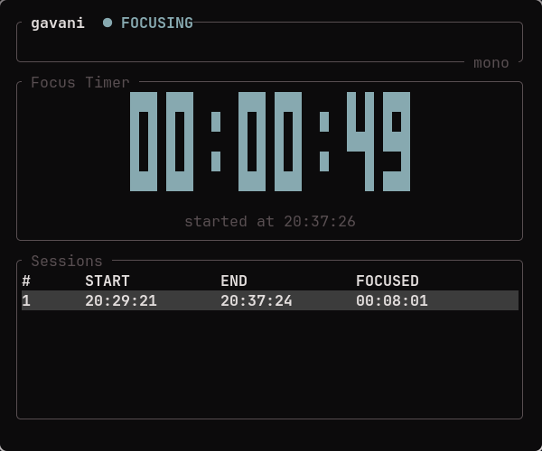

# gavani

A keyboard-driven **focus stopwatch** for your terminal. Start a session when
you begin focusing, stop it when you're done — gavani records every session
with its start time, end time, and total focused duration, like laps on a
physical stopwatch.



## Install / Run

```bash
cargo run --release          # from this directory
cargo build --release        # binary lands in target/release/gavani
```

Requires only a Rust toolchain (`rustup`). Works on Linux, BSD, macOS, and
Windows — no other dependencies.

## Keybindings

| Key           | Action                                  |
|---------------|-----------------------------------------|
| `s`           | start / stop (record) a focus session    |
| `p`           | pause / resume the running timer         |
| `r`           | reset — discard the current session      |
| `j`/`k`, `↑`/`↓` | navigate the session history table    |
| `d`           | delete the selected session              |
| `t`           | cycle themes (choice is saved)           |
| `?`           | toggle the help popup                    |
| `q`, `Ctrl+C` | quit                                     |

Press `?` inside the app any time you forget one.

## Configuration

On first launch gavani writes a default config file you can edit:

- Linux/BSD: `~/.config/gavani/config.json`
- macOS: `~/Library/Application Support/gavani/config.json`
- Windows: `%APPDATA%\gavani\config.json`

```json
{
  "theme": "tokyonight",
  "time_format": "24h"
}
```

- `theme` — one of `"tokyonight"`, `"gruvbox"`, `"dracula"`, `"mono"`
- `time_format` — `"24h"` (`17:38:00`) or `"12h"` (`05:38:00 PM`)

Session history is stored next to it in `sessions.json`. Plain JSON means
you can back it up, script over it, or hand-edit it freely.

### Ideas for future config options

The config struct (`src/config.rs`) was designed to grow:

- `pomodoro`: `{ "enabled": true, "work_mins": 25, "break_mins": 5 }`
- `notify_on_complete`: desktop notification / terminal bell at a target duration
- `confirm_delete` / `confirm_reset`: guard rails before destructive actions
- `show_seconds_in_clock`, custom date formats
- `export_format`: `"csv"` or `"json"` exports of your history
- per-theme overrides (accent colors) instead of fixed palettes

---

# How the code works (for newcomers)

This section walks through the architecture and explains *why* each choice
was made. Reading it top-to-bottom should make every file understandable.

## Architecture overview

```
┌────────────────────────────────────────────────────────┐
│ main.rs        event loop: key → App method → redraw   │
└───────┬────────────────────────────────────────────────┘
        │ calls
┌───────▼───────┐   ┌─────────┐   ┌──────────────────────┐
│ app.rs        │◄──│ ui.rs   │   │ storage.rs           │
│ state machine │   │ drawing │   │ sessions.json I/O    │
│ + logic       │   └─────────┘   └──────────────────────┘
└───────┬───────┘   ┌─────────┐   ┌──────────────────────┐
        │ uses      │ theme.rs│   │ config.rs            │
        └──────────►│ palettes│   │ config.json I/O      │
                    └─────────┘   └──────────────────────┘
```

Data flows in **one direction**: input changes `App` state; rendering reads
that state and paints. The view never mutates the model.

### The three-layer separation (and why)

1. **Logic layer** (`app.rs`) — knows *what* is happening: are we focusing?
   how many seconds elapsed? which row is selected? It contains **zero**
   rendering code.
2. **View layer** (`ui.rs`) — knows *how* to paint. Every function takes an
   immutable snapshot of `App` and draws one frame. It cannot corrupt state,
   because it never touches it.
3. **Input layer** (`main.rs`) — just translation: "the user pressed `p`" →
   `app.pause_resume()`. It makes no decisions.

**Why?** Because the logic can be tested without a terminal. Look at
`src/app.rs`'s test module: pause/resume/reset flows are verified by plain
unit tests that run in milliseconds in CI. If logic and drawing were tangled
together (a very common beginner pattern), none of that would be testable.

## Key design decisions

### 1. State machine for the timer

```rust
enum State {
    Idle,
    Focusing { started_at, instant, accumulated },
    Paused   { started_at, elapsed },
}
```

Instead of booleans like `is_running` + `is_paused` (which allow impossible
combinations such as *running AND paused*), the type system guarantees only
valid states exist. If you have `State::Paused`, you know exactly which data
is available. This is called **making invalid states unrepresentable**, and
it's the single biggest reason Rust code tends not to have "impossible"
bugs. The compiler then forces every `match` to handle all three states —
forget one and your code doesn't compile.

Pause/resume works by banking seconds: pausing stores the elapsed count;
resuming restarts a fresh `Instant` but keeps the banked amount as
`accumulated`. Stop sums both.

### 2. Monotonic vs wall-clock time

- Durations use `std::time::Instant` — **monotonic**, immune to system clock
  changes (NTP syncs, timezone edits, manual changes).
- Display timestamps use `chrono::Local` — wall-clock, so "started at
  17:38" reads naturally.

Mixing these up is a classic timer-app bug: if we used wall-clock for the
elapsed display, changing your system clock mid-session would jump the timer.

### 3. Save-on-mutation persistence

Every mutation (`s` to record, `d` to delete) immediately writes
`sessions.json`. This costs almost nothing (tiny file) and buys crash
safety: kill the terminal mid-session and your history survives. We also
deliberately swallow IO errors (`.ok()`): a read-only disk should degrade to
"in-memory mode", not crash your stopwatch.

### 4. Immediate-mode-ish UI with ratatui

ratatui redraws the whole screen every frame (~4×/sec here). You never patch
individual cells; you describe what the full screen should look like *right
now*. This "UI as a pure function of state" style removes an entire class of
stale-rendering bugs and pairs perfectly with the state/view split above.

### 5. Config-driven presentation

Themes and clock format are data, not code paths. `theme::THEMES` is just an
array of palettes; `config.theme` picks an index into it. Adding a theme =
adding one array entry + one name in the README. No new branches anywhere.

## Coding principles used

- **Separation of concerns** — logic / view / input layers (above).
- **Single Responsibility** — each module does one thing: `storage.rs` only
  persists, `theme.rs` only defines colors, etc.
- **Make invalid states unrepresentable** — the `State` enum, clamped
  selection indices, typed `TimeFormat`.
- **Immutability at the view boundary** — `draw(f, &app)` takes a shared
  reference; Rust enforces that views can't mutate state.
- **Fail soft on IO, fail loud on bugs** — missing/corrupt JSON yields empty
  defaults; logic mistakes surface as failing tests instead.
- **Test the behavior, not the pixels** — tests cover state transitions
  (pause→resume→stop), edge cases (zero-length sessions, out-of-bounds
  deletes), and serialization round-trips.
- **Conventional style** — `cargo fmt` formatting, `cargo clippy` clean,
  doc comments (`//!` module docs, `///` item docs) written for readers new
  to the codebase.

## Patterns you'll recognize

- **State pattern / FSM** — `State` enum drives behavior per phase.
- **MVC-flavored split** — `App` = model, `ui.rs` = view, `main.rs` =
  controller.
- **Facade** — `storage::load/save` hides all path/JSON details behind two
  functions.
- **Data-driven extension** — themes and config values are plain data.

## Project layout

```
gavani/
├── Cargo.toml        dependencies + release profile (LTO, stripped)
├── README.md         this file
└── src/
    ├── main.rs       entry point + event loop + key dispatch
    ├── app.rs        App struct, State machine, all logic + unit tests
    ├── ui.rs         ratatui frames: header, ASCII timer, tables, help
    ├── theme.rs      color palettes (data-only)
    ├── config.rs     config.json load/save + defaults
    └── storage.rs    sessions.json load/save
```

## Building & testing

```bash
cargo build --release   # optimized single binary
cargo test              # unit tests for logic + storage
cargo clippy            # lint checks (should be warning-free)
cargo fmt               # canonical formatting
```

## Roadmap ideas

1. Daily/weekly focus stats panel
2. Tags/notes per session
3. Pomodoro mode driven by config
4. CSV export
5. Desktop notifications on target completion

---

MIT licensed. Named **gavani** — press `s`, focus, press `s` again.
